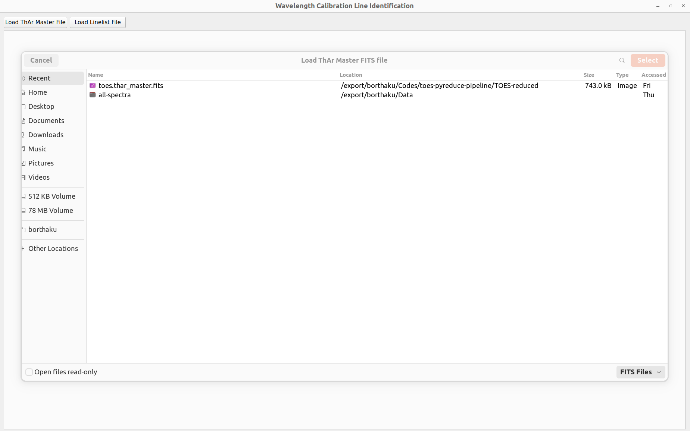

This is a GUI you can use to identify lines in each order and mark their respective wavelengths. The saved linelist can be used 
for wavelength calibration later. There are two buttons on top to load a lamp spectrum and a previously generated linelist. 
Loading the linelist is optional. The lamp spectrum is in fits format with the shape: (number of orders, number of pixels
along dispersion axis). The linelist is saved as npz format with wavelengths, order numbers, central pixel, width of the 
line in pixel coordinates, height of the line, a Boolean value as Flag for the line. 

**Fig. 1:** Example image on loading lamp spectrum.

The interface will show you a plot on the left for each order and the table containing the already selected lines for that 
order on the right. You can select a line by clicking and dragging on the plot. To add the line on the table, click add 
line button. Red lines on the plot highlight which lines are on the table and their respective wavelengths. If you want to
change a number in the table, you can click and edit on the table and click update, to update the table and the table. You 
can click Save to save the new table. There is a select button for each row in table. By default, all rows are selected. In 
case you do not want to save a particular row or do not want it to show on the plot, de-select there. You can check the spectrum
for different orders on the top by either scrolling or by clicking at different orders.

**Fig. 2:** Example image of the GUI with lamp spectrum and linelist.